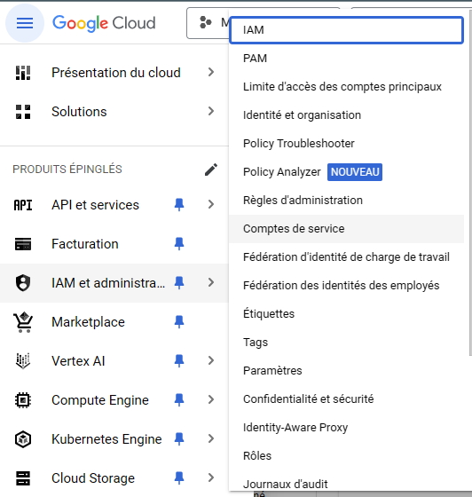
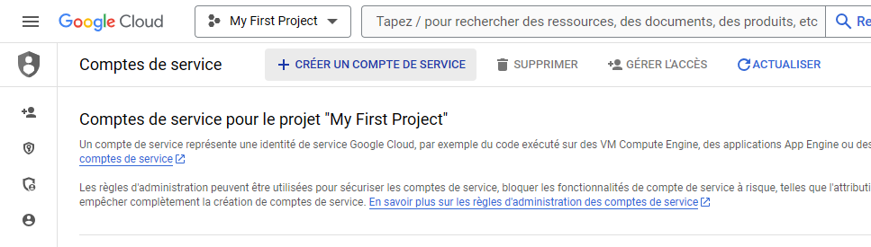
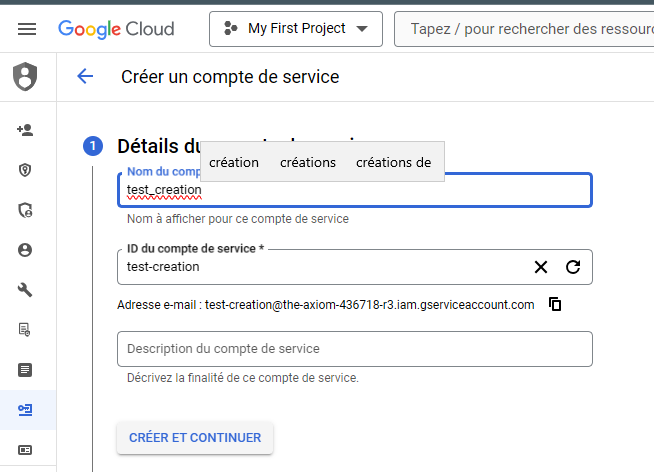
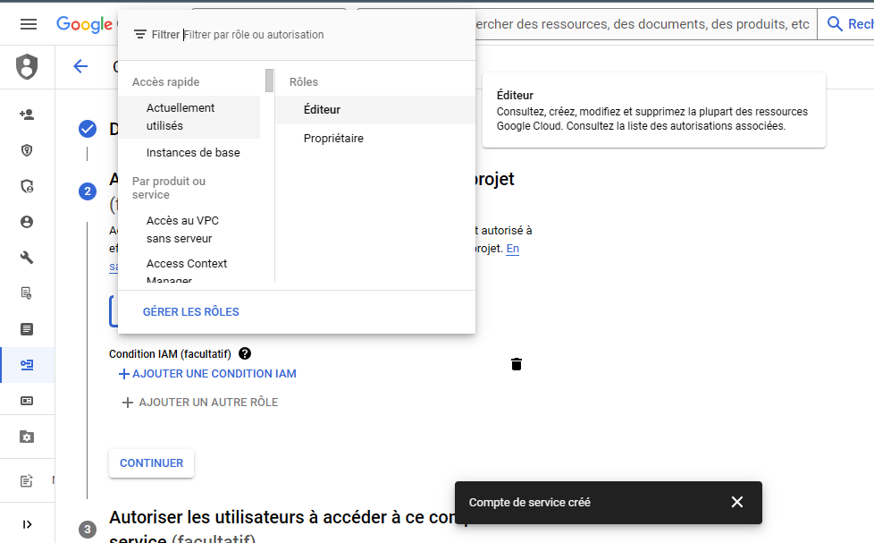
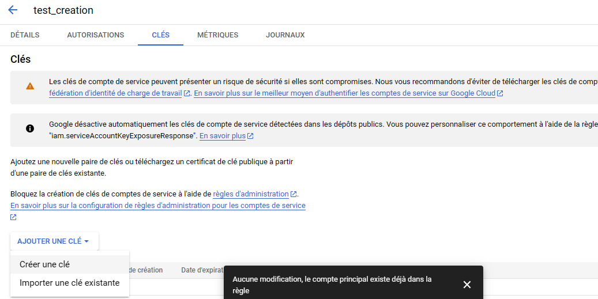
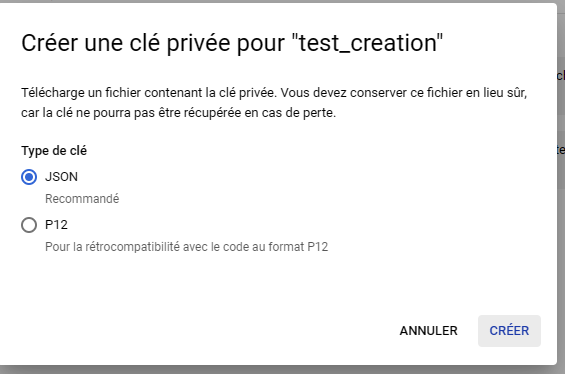
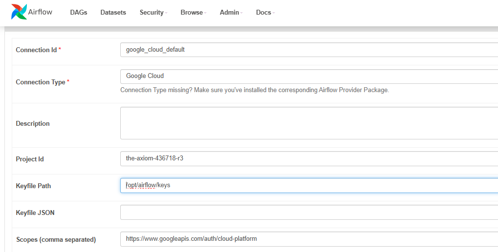

# GitHub Trends with Airflow and BigQuery
## Overview
This project integrates **Apache Airflow** with **Google BigQuery** to automate the aggregation of daily statistics from GitHub repositories and **Hacker News**. The workflow runs on Airflow using a Dockerized environment and leverages BigQuery for data storage and analysis. 

## Important Information

- **Project Source**: The code for this project is located in the **master branch**.
- **Documentation**: Comprehensive documentation can be found in the **main branch**.
## Key Features

- **Automated DAG** for aggregating daily GitHub repository and Hacker News statistics.
- **Docker-based setup** for easy deployment of Airflow with BigQuery integration.
- **Efficient data extraction** from GitHub and Hacker News.
- **Reliable and scalable pipeline** using Airflow's LocalExecutor and PostgreSQL as the metadata database.

## Prerequisites

To run this project, you will need the following:

- **Docker** and **Docker Compose** installed.
- **Google Cloud account** with access to **BigQuery** and relevant open-source datasets.
- **A service account (Cloud Console) with a Google Cloud JSON key** for authentication.

# Installation and Setup

1. **Clone the repository:**
   ```bash
   git clone https://github.com/yourusername/airflow-bigquery-project.git
   cd airflow-bigquery-project 
   # Run the Docker environment:
   docker-compose up'''
   ***Access Airflow UI:*** Once the services are up and running, access the Airflow UI at http://localhost:8080 to monitor and manage the DAGs.
2. **Set up the environment**
   
## Steps to Create a Service Account and Download the Key

To create a service account in Google Cloud and download the JSON key, follow these steps:

1. **Navigate to IAM & Admin**  
   Go to the Google Cloud Console and navigate to **IAM & Admin**.  
   

2. **Access Service Accounts**  
   In the sidebar, click on **Service Accounts**.  
   

3. **Create a New Service Account**  
   Click the **Create Service Account** button.  
   

4. **Fill in Service Account Details**  
   Enter the required details such as the **Service Account name**, **ID**, and **description**.  
   

5. **Create a Key for the Service Account**  
   Click on **Create Key**.  
   

6. **Download the JSON Key**  
   Choose **JSON** as the key type and click **Create** to download the file.  
   

### Instruction:
Add your **Google Cloud JSON key file** to the `./keys` directory.

---

## Set up Airflow Connection and Variables

1. **Create a Google Cloud Connection in Airflow**  
   After obtaining the GCP key, you need to create a connection in **Admin** -> **Connections** using your key.

   In Airflow, define a connection named `google_cloud_default` to link to your Google Cloud project:  
   

2. **Configure Airflow Variables**  
   After setting up the connection, navigate to the `bigquery_github_trends` DAG and enter the values for the configuration variables in **Admin** -> **Connections**:

   

   - **BQ_PROJECT**: The BigQuery project you're working on.
   - **BQ_DATASET**: The BigQuery dataset you're using.

### Instruction:
Add your **Google Cloud JSON key file** to the `./keys` directory.

## Testing Your DAG in Apache Airflow

To ensure your DAG is functioning as expected after setting up connections and configuration variables, it's essential to test specific tasks within the workflow. Use the command:

```bash
docker-compose exec webserver airflow tasks test [DAG_ID] [TASK_ID] [EXECUTION_DATE] '''

to initiate the test. Replace [DAG_ID], [TASK_ID], and [EXECUTION_DATE] with the relevant details of your workflow. For instance, you can test the task bq_check_hackernews_github_agg from the bgtest DAG for the date 2023-09-27 by running the command:

'''bash
docker-compose exec webserver airflow tasks test bigquery_github_trends bq_check_hackernews_github_agg 2023-09-27'''


This process is crucial for verifying the integrity of your data pipeline and ensuring smooth operations within your Airflow setup

   
